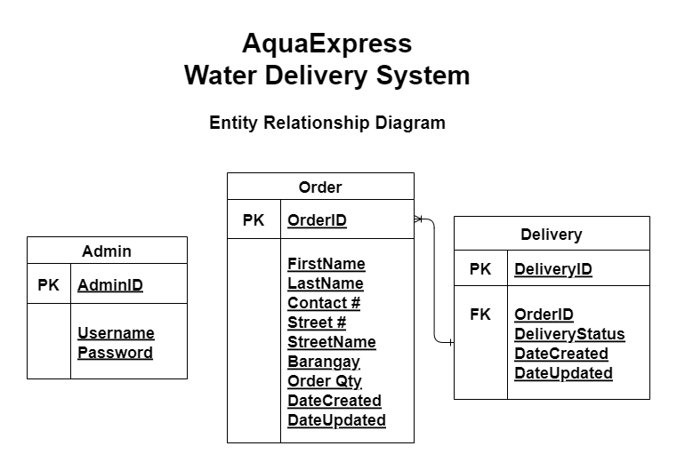
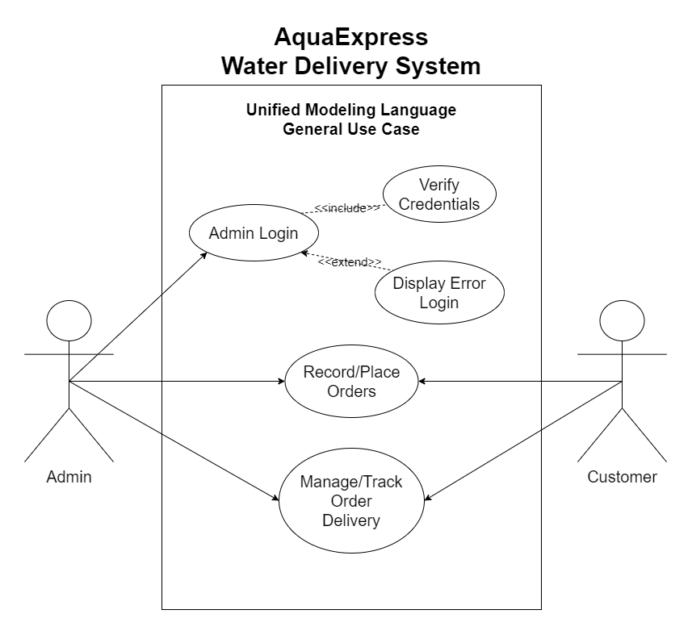

# Project Title:
<strong>AquaExpress<strong>

 

# Description

This is the backend for my project 4. It is called AquaExpress, a simple app using JavaScript, Node, Express and MongoDB.
 

_The app functionalities are:_
* Customer will be able to place an order for water deliveries
* Customer will be able to track an existing order for water deliveries
* Admin will be able manage delivery status for water deliveries

 

# Dependencies
* bcrypt
* body-parser
* cors
* express
* helmet
* mongoose
* morgan

 

# Installing

* Copy the *url*
* Go to your terminal, type "git clone + *url*"
* Install all dependencies, type "npm install" or "npm i"

 

# Executing program

* To execute the program, go to your terminal and type "node index.js" or "npm start"

 

# END POINTS 

## ADMIN
REGISTER NEW ADMIN - /api/v1/auth/admin-register \
LOGIN AUTHENTICATION - /api/v1/auth/admin-login

## ORDERS
CREATE ORDER - /api/v1/orders \
GET ORDERS - /api/v1/orders \
UPDATE ORDER - /api/v1/orders/:id \
DELETE ORDER - /api/v1/orders/:id

## DELIVERIES
GET ALL DELIVERIES -/api/v1/deliveries \
GET ALL ORDERS IN A DELIVERY - api/v1/deliveries/:id \
CREATE NEW DELIVERY - /api/v1/deliveries \
UPDATE DELIVERY - api/v1/deliveries/:id \
DELETE DELIVERY - api/v1/deliveries/:id

 
 

# PROJECT DIAGRAMS

 

# Author
John Eric A. Darlucio\
[@ericdarlucio.ece](https://gitlab.com/ericdarlucio.ece)

